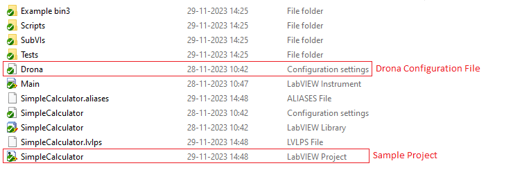

# SLL Drona
## Vision
To provide an open-source Labview UI Testing Framework to automate manual UI testing. 

UI testing plays an important part in the Overall testing process of each application/product. Drona allows Engineers to automate the UI test by writing test cases that involve the concept of setting values to UI controls and asserts it to check the test case. It increases the overall software quality, which is predominantly needed in today's existing or developing products. It also reduces the time taken by Engineers to test the UI.

## SLL Drona in GLA Summit
SLL Drona as an Open Source LabVIEW UI testing framework was presented at GLA Summit 2022. For more details please watch the [video](https://www.youtube.com/watch?v=4JryzEPQexM)

## Minimum Compatible LabVIEW Version
The source code is saved with LabVIEW 2016.

## Installation
Please find the latest SLL Drona package available [here](https://github.com/solitontech/SLL-Drona/releases/tag/v1.0.0) and install it using VI Package Manager.

## Usage
Drona provides a library of VIs that are used to automate and test the UI without any flaws. It can be used to test any LabVIEW application and supports creating test cases from SLL Drona APIs.

## Palette
To test the UI of the application you need to create the test cases using corresponding SLL Drona APIs. It can be accessed under the following location.

### In Block diagram:
Functions Palette -> Addons -> SLL Drona 

## Workflow
Drona provides a library of APIs that helps to create test cases for UI testing. There are certain steps in creating a test case to make the workflow of the UI testing smooth and possible. The 4 steps that need to be followed for creating test cases are:

1. [Setup](#1-setup)
2. [Stimulus](#2-stimulus)
3. [Assert](#3-assert)
4. [Cleanup](#4-cleanup)

You can find the related APIs to these steps in the SLL Drona palette

### 1. Setup:
<ul> The first step in creating the test case is setting up the project and creating a Drona configuration file parallel to the Project. The configuration file includes the Launcher VI path, which is relative to the INI file, and options for opening and running the VI while executing the test. Test cases can be created after configuring the file. The Application reference and VI reference obtained from Setup VI are used to create test cases.

If you are using Drona for a LabVIEW application, then the INI file has to be created parallel to it.</ul>
 <b>Sample folder structure for the Drona INI file</b> 

<b>Sample format required for creating a Drona configuration file</b>

### 2. Stimulus:
<ul>Stimulus is used to assign values to the UI controls based on the need and provide instructions, for the operations to be performed. This poly API available in the SLL Drona palette provides a set of stimulus VIs that help you in assigning the value for various types of control. </ul>

    
<ul>Set values for a control that is inside a tab control or any other object by giving a proper valid control path and value for that control. The control path contains the label name of the controls with delimiters to access the specific control. </ul>

For example, To access the numeric control as in the below depicted UI, the control path has to be given as:  
  
*Tab Control>>Cluster>>Numeric*  
  
The label name has to be given as mentioned above. Make sure it is the same as the label name and is case-sensitive. </ul>

### 3. Assert:
<ul>This API can be used to assert the value of the controls and return whether the test is passed or failed. This poly API available in the SLL Drona palette provides a set of assert VIs that help in asserting the values. </ul>

     
<ul>As same as the stimulus a valid control path has to be given. There is a set of Assert VIs available in the SLL Drona palette which can be used to assert the value and obtain the results. </ul> 

For example, To assert the value for the string in the below sample UI the input has to be given as  
 
*Tab Control>>Tab Control 2>>Cluster>>String*  

### 4. Cleanup:
<ul> This VI closes all the references that are opened while setting up the test case. Provide this VI with the Launcher VI reference and application reference that need to be closed. </ul>

## Unit Tests
Find the examples for different use cases in the following path:  
<*LabVIEW>\vi.lib\SLL Drona\Examples*   
There are 5 different types of examples available here based on the use case.
To learn more about the use cases please visit the test cases under the following path:  
<*LabVIEW>\vi.lib\SLL Drona\Test\Tests\SubTests* 

## Package Build
For further information on how to build the SLL Drona package, please refer to this [document](BUILD.md).

## Contributing 
### Steps for contributing to SLL Drona:
+ Fork the main repository
+ Create a new branch and make the changes with it
+ Commit your changes 
+ Push to the new branch
+ Submit a pull request 

To contribute to SLL Drona, you need to have a LabVIEW 2016 32-bit development environment.

## License 
SLL Drona is distributed under MIT [license](https://github.com/solitontech/SLL-Drona/blob/main/LICENSE). 

## Credits
SLL Drona uses open-source components. You can find the source code of their open-source projects along with license information below. We acknowledge and are grateful to these developers for their contributions to open source. 

* Project: Caraya https://github.com/JKISoftware/Caraya  
License (BSD): https://github.com/JKISoftware/Caraya/blob/master/LICENSE.md

* Project: SLL Toolkit https://github.com/solitontech/SLL-Toolkit  
License (MIT): https://github.com/solitontech/SLL-Toolkit/blob/master/LICENSE

* Project: OpenG https://sourceforge.net/projects/opengtoolkit/   
License: BSD

* Project: NI Forum https://forums.ni.com/t5/Example-Programs/ct-p/code-documents  
License: MIT

## Inviting users and contributors

Please fill out the below form if you are interested in trying out and/or contributing to SLL Drona.
https://forms.office.com/r/jQkLb2WeL6
